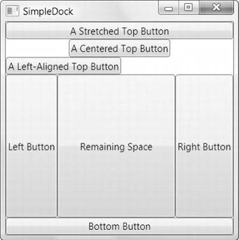

# DockPanel


```xaml
<DockPanel LastChildFill="True">
  <Button DockPanel.Dock="Top">A Stretched Top Button</Button>
  <Button DockPanel.Dock="Top" HorizontalAlignment="Center">
   A Centered Top Button</Button>
  <Button DockPanel.Dock="Top" HorizontalAlignment="Left">
   A Left-Aligned Top Button</Button>
  <Button DockPanel.Dock="Bottom">Bottom Button</Button>
  <Button DockPanel.Dock="Left">Left Button</Button>
  <Button DockPanel.Dock="Right">Right Button</Button>
  <Button>Remaining Space</Button>
</DockPanel>
```

The order matters:
- If a `Bottom` control is placed after the center control, it will not be displayed unless `LastChildFill` is false.
  
  [WPF `<StatusBar>` is not positioned at the bottom of the window - Stack Overflow](https://stackoverflow.com/questions/2311458/wpf-statusbar-is-not-positioned-at-the-bottom-of-the-window)

- If a `Left` control is before the `Bottom` control, then the `Left` control will occupy all the height after the `Top` control, otherwise it will not and the `Bottom` control will occupy all the width.

## Splitter
- [DockPanel Splitter Control for WPF - CodeProject](https://www.codeproject.com/Articles/34377/DockPanel-Splitter-Control-for-WPF)
- [DockPanelSplitter: Like WPF's GridSplitter, but for DockPanel instead of Grid.](https://github.com/JVimes/DockPanelSplitter)