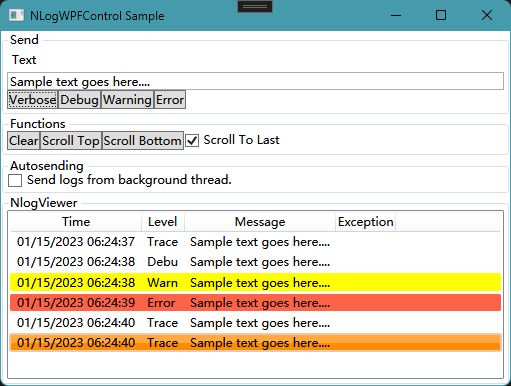

# Logging
- [Microsoft.Extensions.Logging](https://learn.microsoft.com/en-us/dotnet/core/extensions/logging)
- [NLog](https://nlog-project.org/) ([GitHub](https://github.com/NLog/NLog))

## [NLog](https://nlog-project.org/)
[GitHub](https://github.com/NLog/NLog)

WPF:
- [dojo90/NLogViewer: A ui control library to visualize NLog logs](https://github.com/dojo90/NLogViewer)

  

  No .NET Framework support.
- [erizet/NlogViewer: A simple WPF-control to show NLog-logs.](https://github.com/erizet/NlogViewer)

  

  - [NKnife.NLog.WPF](https://github.com/xknife-erian/nknife.nlog.wpf)
- [WpfUtility](https://github.com/MunkiWinchester/WpfUtility#nlogviewer)

  
- [WaiMvvmToolkit](https://www.nuget.org/packages/WaiMvvmToolkit/)
- [NLog.Wpf.RichTextBox](https://www.nuget.org/packages/NLog.Wpf.RichTextBox/)
- [NLog.WPF](https://github.com/ShiJess/Link.NLog.WPF)

  RichTextBoxTarget.
  